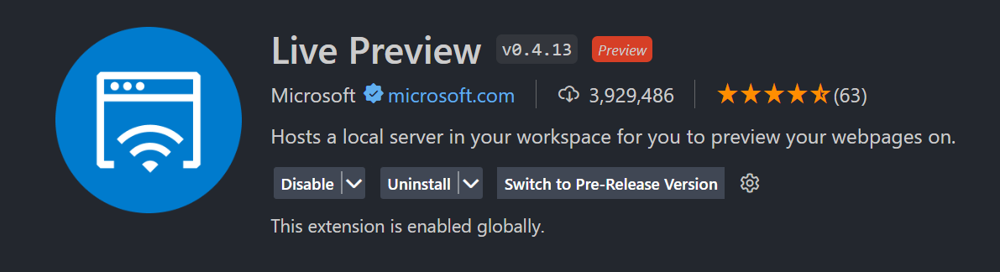
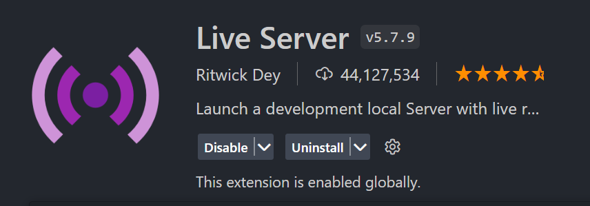

<a id="top"></a>

# HTML - HyperText Markup Lenguage - Lenguaje de Marcado de Hipertexto

#### Table of Contents

- [HTML - HyperText Markup Lenguage - Lenguaje de Marcado de Hipertexto](#html---hypertext-markup-lenguage---lenguaje-de-marcado-de-hipertexto) -
  [Table of Contents](#table-of-contents)
  - [Etiquetas](#etiquetas)
    - [h1 - h6 ](#h1---h6-)
    - [p ](#p-)
    - [strong ](#strong-)
    - [ul ](#ul-)
    - [ol ](#ol-)
    - [li ](#li-)
    - [input ](#input-)
  - [Atributos](#atributos)
    - [id](#id)
    - [class](#class)
  - [Aclaraciones](#aclaraciones)
  - [Maquetando mi primera pagina con HTML](#maquetando-mi-primera-pagina-con-html)
  - [Ir a la clase de CSS](../css/readme.md)
  - [Ir a la clase de JS](../../JS/readme.md)

Para entender las siglas, veamos primero que no es HTML:

HTML no :

- Se dedica a decidir como se interactua con el contenido ( para eso esta JS )
- Se dedica a como se ve el contenido ( para eso esta CSS )

Entonces que es?

HTML es un lenguaje que describe el contenido, si en cursiva, en negrita, como
lista numerica o como lista con punticos, etc.

---

Para trabajar con HTML, les recomiendo que instalen Live Preview para ver los
cambios desde el VSC en vivo  </br>

Tambien esta Live Server que lo renderiza en el navegador.


En HTML todo se conforma por medio de etiquetas

## Etiquetas

Una etiqueta es un elemento que indica como se debe interpretar el contenido.

Por ejemplo: para escribir un parrafo, usamos: `<p>Este es un parrafo</p>`

Donde `<p>` se conoce como 'etiqueta de apertura', `</p>` se conoce como
'etiqueta de cierre' y a todo en conjunto `<p>Este es un parrafo</p>` se conoce
como 'elemento'.

Asi como esta, existen multiples etiquetas para diversos fines. Les comparto la
documentacion oficial de HTML
[aqui](https://developer.mozilla.org/es/docs/Web/HTML)

Veamos unas de las etiquetas principales:

### h1 - h6 </br>

Etiquetas utilizadas para titulos y subtitulos. </br> Por ejemplo: </br>
`<h5>Hola, soy un subtitulo</h5>` devuelve: <h5>Hola, soy un subtitulo</h5>

### p </br>

Etiqueta para los parrafos. </br> Por ejemplo: </br>
`<p>Hola, soy un parrafo</p>` devuelve: <p>Hola, soy un parrafo</p>

### strong </br>

Etiqueta para resaltar un texto en negrilla. </br> Por ejemplo: </br>
`<strong>Hola, soy un strong</strong>` devuelve:</br> <strong>Hola, soy un
strong</strong>

### ul </br>

Etiqueta para generar una lista desordenada (con puntitos). </br> Por ejemplo:
</br> `<ul>Hola soy una ul</ul>` devuelve: <ul>Hola soy una ul</ul>

### ol </br>

Etiqueta para generar una lista ordenada (con numeros). </br> Por ejemplo: </br>
`<ol>Hola soy una ol</ol>` devuelve: <ul>Hola soy una ol</ul>

Aca me gustaria hacer un parentesis para mencionar que algunos elementos no
necesitan etiqueta de cierre, veamos unos ejemplos:

### li </br>

Etiqueta para cada uno de los items de una lista. </br> Por ejemplo: </br>
`<ul><li>Hola soy un item en una ul</ul>` devuelve: <ul><li>Hola soy un item en
una ul</ul> `<ol><li>Hola soy un item en una ol</ol>` devuelve: <ol><li>Hola soy
un item en una ol</ol>

### input </br>

Etiqueta para agregar una entrada de tipo texto, para subir archivos, para
agregar fechas, es multiproposito

Y aqui entramos en un ambito donde es necesario definir como le damos un
proposito especifico a este tipo de etiquetas Esto es gracias a los atributos

## Atributos

Un atributo es una palabra que se le agrega a la etiqueta, dichas palabras ya
vienen incorporadas en la etiqueta y nos permiten personalizar la etiqueta, en
sentido a como se va a comportar

Veamos algunos ejemplos:

`<input type="date">` Permite establecer una fecha: <input type="date">

`<input type="password">` Permite escribir texto y que automaticamente muestra
en vez de texto, puntos o asteriscos para que no sea visible:
<input type="password">

`<input type="color">` Permite escoger un color: <input type="color">

`<input type="checkbox">` Genera un checkbox: <input type="checkbox">

`<input type="range">` Genera un slidebar: <input type="range">

``
Integra una foto, donde src sirve para agregar la imagen, que puede ser un link
externo como este o una ruta del pc, por su lado, el atributo alt sirve para
mostrar una descripcion de la foto en caso de que no se pueda cargar:


Y asi, muchos otros...

Entre tantos, es necesario resaltar 2 atributos escenciales: id, class

### id

Este atributo permite identificar a un elemento de manera unica Nos va a servir
mas adelante para ionvicar a la etiqueta cuando estemos creando los
estilos.</br> Por ejemplo:</br> `<input type="text" id="input">`

### class

Este atributo permite identificar varios elementos con el mismo nombre y de esa
forma aplicarle los mismos estilos.</br> Por ejemplo:</br>
`<input type="text" class="input">`</br>
`<input type="text" class="input">`</br>
`<input type="text" class="input">`</br>

## Aclaraciones

Si haz llegado hasta aca, seguro habras notado que te he mencionado la
definicion de HTML, la cual nos dice que solo las etiquetas deben describir el
texto, mas no en como se ve, pero claramente con un h1 y un h5 notamos
diferencia mas alla del como se describen:

Esto es un h1

<h1>Hola, soy un titulo</h1>
</br>
Esto es un h5
<h5>Hola, soy un subtitulo</h5>

No solo es notable el tamaño de la letra, sino el espacio que deja la etiqueta
entre lineas.

Bueno, esto es debido a que el navegador trae unos estilos por defecto para cada
etiqueta. Por esto fue que se creo
[css reset](https://meyerweb.com/eric/tools/css/reset/) que, como puedes ver, es
un conjunto de etiquetas, con los margenes, las fuentes de letra y demas, en
cero.

Esto es recomendable, debido a que como cada navegador tiene sus configuraciones
por defecto, si creas una aplicacion en base a un navegador y no haces el reset,
probablemente se te vea diferente en otro navegador.

No te preocupes, abordaremos esto en el curso de CSS

## Maquetando mi primera pagina con HTML

1. Para comenzar, necesitas crear un archivo con la extension .html, en mi caso
   la llamare idex.html
2. Debes definir el formato para decirle que tipo de documento estas creando.
   </br> `<!DOCTYPE html>`. </br>
3. Crea una etiqueta de apertura y una de cierre para decirle que alli alojaras
   el codigo html. Agregando un atributo lang para identificar el lenguaje de la
   pagina </br> `<html lang="es"></html>`. </br>
4. Vamos a crear dos elementos muy importantes: <strong>head y body</strong>. En
   head van todas las etiquetas que hablan del contenido de la pagina, nada de
   lo que pongamos en el head se va a mostrar al usuario y en body van todas las
   etiquetas que muestran el contenido en si.
5. Puedes agregar una etiqueta meta a head con el atributo charset y que su
   valor sea un string de "UTF-8", esto permite a la pagina entender el tipo de
   escritura, emojis, tildes y demas elementos que conforman nuestro lenguaje.
   > NOTA: Por ahora nuestra pagina tiene el siguiente maquetado:

```html
<!DOCTYPE html>
<html lang="es">
  <head>
    <meta charset="UTF-8" />
  </head>
  <body></body>
</html>
```

6. Agrega una etiqueta meta en el head con el atributo name y su valor "viewport
   y un atributo content con su valor "width=device-width". Esto lo que le
   indica es que se adapte para que el ancho del contenido que nosotros vamos a
   crear sea el ancho de pantalla del dispositivo.
7. Incorpora una etiqueta title en el head y agrega el titulo que prefieras, en
   mi caso sera "Mi primera app".

8. Puedes agregar un icono a tu pagina, para esto, agrega la etiqueta link en tu
   head con el atributo rel y su valor sera icon y un atributo href y su valor
   sera el link de la imagen que quieras, en mi caso elegire el del perrito

   Echemos un vistazo:

   ```html
   <!DOCTYPE html>
   <html lang="es">
     <head>
       <meta charset="UTF-8" />
       <meta name="viewport" content="width=device-width" />
       <title>Mi primera app</title>
       <link
         rel="icon"
         href="https://img.freepik.com/foto-gratis/aislado-feliz-sonriente-perro-fondo-blanco-retrato-2_1562-691.jpg?size=626&ext=jpg&ga=GA1.1.1412446893.1705708800&semt=ais" />
     </head>
     <body></body>
   </html>
   ```

Por ahora podemos dejar asi al head, podemos comenzar con el body:

> NOTA: Me parece importante remalcar que HTML tiene mas de 100 etiquetas y que
> si bien es complicado aprenderlas todas, la idea es sacarle el mayor provecho
> a la semantica de estas, esto quiere decir, usar cada etiqueta segun su
> proposito.

La idea es crear una pagina que hable de nosotros, asi que:

1. Vamos a crearnos una etiqueta header que es la encargada de nuestro
   encabezado
2. Alli armaremos un h1, en mi caso le pondre: "Portafolio de Feli".
3. Incorporaremos un parrafo breve que cuente algo de mi.
4. Afuera del header crea una etiqueta nav y a medida que le agreguemos
   secciones, llenar esta etiqueta con los titulos, de esa manera podremos
   redireccionarnos a cada seccion.
5. Primero crearemos una seccion que diga cuales han sido mis Experiencias
6. Un h2 con el titulo de "Experiencia".
7. Una ul para agregar las empresas en las que has trabajado
8. Ahora crearemos una seccion que diga cuales han sido mis estudios, puede ser
   una ul o una ol.
9. Luego, una seccion que ira enfocada en Tecnologia.
10. Alli, crearemos dos article, uno para tecnologias favoritas.
11. Y otro que diga cuales son las tecnologias que me gustaria aprender, en este
    caso con una ol, en relacion al orden de prioridad o interes de cada
    tecnologia.
12. Agregaremos una seccion con el titulo de hobbies. Como esto es algo externo
    a mi portafolio, lo agregaremos a una etiqueta llamada aside y lo listaremos
    en una ul.
13. Escogeremos 3 hobbies y les agregaremos su respectiva imagen.
14. Finalizaremos con un footer que diga la informacion de derechos reservados y
    si gustan la info de contacto.
    > Puedes agregarle mas imagenes si gustas, los estilos se los daremos en la
    > clase de CSS.

> NOTA: Puedes ver el resultado final en el index.html de esta carpeta

🥳 Felicidades!! Hemos concluido nuestro curso </br> Nunca pares de aprender! 🚀

[Ir a la clase de CSS](../css/readme.md)

[Ir a la clase de JS](../../JS/readme.md)

[Regresar al inicio](#top)

</br>
